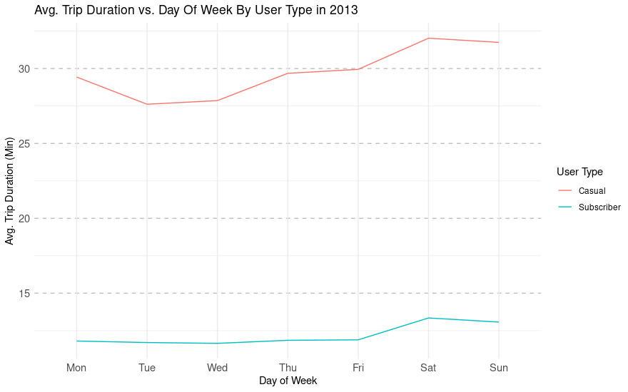

## Scenario

You are a junior data analyst working in the marketing analyst team at Cyclistic, a bike-share company in Chicago. The director of
marketing believes the company’s future success depends on maximizing the number of annual memberships. Therefore, your
team wants to understand how casual riders and annual members use Cyclistic bikes differently. From these insights, your team will
design a new marketing strategy to convert casual riders into annual members. But first, Cyclistic executives must approve your
recommendations, so they must be backed up with compelling data insights and professional data visualizations.

## About The Company

In 2016, Cyclistic launched a successful bike-share offering. Since then, the program has grown to a fleet of 5,824 bicycles that are
geotracked and locked into a network of 692 stations across Chicago. The bikes can be unlocked from one station and returned to
any other station in the system anytime.

Until now, Cyclistic’s marketing strategy relied on building general awareness and appealing to broad consumer segments. One approach that helped make these things possible was the flexibility of its pricing plans: single-ride passes, full-day passes, and
annual memberships. Customers who purchase single-ride or full-day passes are referred to as casual riders. Customers who
purchase annual memberships are Cyclistic members.

Cyclistic’s finance analysts have concluded that annual members are much more profitable than casual riders.Although the pricing
flexibility helps Cyclistic attract more customers, Moreno believes that maximizing the number of annual members will be key to
future growth. Rather than creating a marketing campaign that targets all-new customers, Moreno believes there is a very good
chance to convert casual riders into members. She notes that casual riders are already aware of the Cyclistic program and have
chosen Cyclistic for their mobility needs.

Lily Moreno, the director of marketing, has set a clear goal: Design marketing strategies aimed at converting casual riders into annual members. In order to do
that, however, the marketing analyst team needs to better understand how annual members and casual riders differ, why casual
riders would buy a membership, and how digital media could affect their marketing tactics. Moreno and her team are interested in
analyzing the Cyclistic historical bike trip data to identify trends.

## Problem To Solve

The problem we are trying to solve is identifying how annual members and casual riders use Cyclistic bikes differently. We can then use those insights to find under what conditions a casual rider would buy a membership. Therefore, the marketing director can create an effective marketing campaign to influence casual riders to become annual members.

## Task

The main task for this analysis is to find out what makes casual riders different from annual riders so we can influence casual riders to become yearly subscribers. The key stakeholders are the director of marketing and the Cyclistic executive team.

## Preperation

Cyclistic’s historical trip data can be downloaded [here](https://divvy-tripdata.s3.amazonaws.com/index.html) (Note: The datasets
have a different name because Cyclistic is a fictional company. For the purposes of this case study, the datasets are appropriate
and will enable you to answer the business questions. The data has been made available by Motivate International Inc. under this
[license](https://www.divvybikes.com/data-license-agreement)). For this analysis, we will be working with data from the entire year of 2013. This data is in CSV format, which can be imported into a spreadsheet program or any other data analysis tool. Also, this data is first-party, so we can assume it is reliable, original, and current to our needs.

At first glance at our data set, we notice that there are a few things that we will need to keep in mind. First, there are missing values, and second, in the 'stoptime' column, the time has zeros for the seconds part of the time, which is incorrect since we have another column that tells us the trip duration in seconds. The 'stoptime' issue is easily fixable in the next step, but we must ignore the missing values for now. The good news is that although it could help us gain more insight into the data, we don't need those missing values to analyze and answer the business question.

## Process and Clean
We will use R programming language to process, clean, and analyze our data. Although other tools, such as a spreadsheet program or SQL, can do the same thing, I chose R because of its flexibility and capabilities. As it is now, our data is not ready to be analyzed. We need to process or clean it and transform it into something usable for our analysis needs. Below is a list of things done to change the data into a clean dataset ready for analysis. Check this [GitHub](https://github.com/ElwinCabrera/Data-Analytics-With-R-Case-Study) repository for details on how the data was cleaned in R. 

* Renamed column "tripduration" to "tripduration_sec".
* The word "Customer" was replaced with "Casual" to remove confusion because subscribers are also customers.
* The values in column "starttime" had the format "YYYY-MM-DD HH:MM:SS" These values were separated into two columns, "start_date" and "start_time" in format "YYYY-MM-DD" and "HH:MM:SS" respectively. I did the same process with the "stoptime" column.
* The new "stop_time" column was updated to have the correct stop values. This was calculated by adding the values "start_time" and "tripduration_sec" to get the actual stop time.
* Added a column called "tripduration_min." this was done by converting the values in "tripduration_sec" and dividing it by 60.
* Added a column called "age" to calculate each user's age by subtracting the values in "birthday" by 2013.
* Added a column called "start_day_of_week" that is just the day of the week, Mon-Fri, based on the "start_date" column.
* Added a column called "is_weekend" determining if the "start_date" is a weekend or not.

Now that our data is squeaky clean, we can start analyzing it!

## Analysis and Findings

Looking at the cleaned data, I wanted to dig deeper to see if I could gain insight into the differences between casual riders and subscribers. I wondered how the number of trips and the average trip duration relate to age, gender, hour of day, day of the week, and month for casual riders and subscribers. The previous question was enough to get me started in analyzing the data.

Based on the data, my first question was, who uses the service the most, casual riders or subscribers? The second question was, how long are casual riders and subscribers using the service? I wanted to know the answers to those questions by gender, age group, month, day of week, and hour of day.

#### Total Number of Trips vs. gender, age, month, day of the week, and hour of the day for each user type
The first graph shows the relationship between the user type, casual or subscriber, and the number of trips taken for each. The second graph shows the same information but as a percentage of all trips.

{width=50%} 
{width=50%}

The graphs show that more than half of the total trips taken in 2013 were by subscribers. This fact is helpful, but we must dig deeper to discover more. 

Below is a graph that shows the same data as before but broken down by gender for each user type. 'NA' is users that we don't have gender data for.

Even with the missing gender values for casual riders, this graph still gives us more insight into what type of people use the service. We see from the chart that we have gender values for all subscribers. This information tells us that men ride more often than women out of only the subscriber population.

Now, let's look at the number of trips for each age group for only subscribers. This data only shows subscribers' ages as there is little age data on casual riders, and including age data on casual riders would not make an accurate comparison.

The information above shows that most subscriber trips are done by users between 25 and 45 years of age. 

The following three graphs show the relationship between the total number of trips taken each month, day of week, and hour of day for casual riders and subscribers.

In Figure 4.1, we can see that most trips occur between June and August for casual users, with August having the maximum number of trips. For subscribers, we see a similar situation, with most trips happening between June and October, with the maximum number of trips occurring in October. For casual and subscriber users, trip numbers drop around the fall and winter months.

The most interesting statistics for this data are shown in Figure 4.2 and Figure 4.3. 

Figure 4.2 shows that most subscribers use the service the most during the days between Monday and Friday before dropping off significantly from Friday to Sunday. However, it's the opposite for casual riders, with the lowest number of trips happening between Monday and Friday before dramatically increasing from Friday to Saturday.

For Figure 4.3. During the day, we see two big spikes in the number of trips for subscribers, which occur at 8 am and then again at 5 pm. For casual users, you see almost a normal distribution for the number of trips for any given hour.

After finding out what type of user rides more who are they, and when do they ride the most I wanted to see what type of user rides more broken down by gender and user type since we have gender information in our dataset.

#### Average Trip Duration vs. month, day of the week, and hour of the day for each user type

We will now look at how the average trip duration changes each month, day of the week, and hour for casual riders and subscribers.

The figure below shows the average trip duration for all casual and subscriber users. 

Casual users ride on average for 30 minutes, more than twice as long as subscribers at 12 minutes.

The following three graphs show the relationship between the average monthly, day of the week, and hourly trip duration for casual riders and subscribers.

{width=100%}

{width=100%}
{width=100%}

Figure 6.1 shows us that there is a decline in the average trip duration for both types of users from July to December. However, this decline is by little.

Figure 6.2 shows us an almost constant average trip duration for every day of the week for both casual and subscriber users.

In Figure 6.3, we see that the average trip duration stays relatively constant for subscribers. In contrast, casual riders see a spike in the average trip duration between hours 1 am and 4 am before stabilizing to a reasonably consistent time.

I wanted to see why there was a spike in the average trip duration between 1 am and 4 am for casual riders, so I decided to dig deeper. The graph in Figure 7.1 shows the total number of trips casual riders take between hours 1 am and 4 am each day of the week. 

 

The figure above shows that the average trip duration spikes between 1 am and 4 am, mainly from Friday to Sunday.

## Findings and Predictions

Below is a list of all the key findings for this analysis based on the data presented and all information gathered.

* Subscribers take trips more often than casual riders.
* Out of all of the Subscribers, male subscribers take trips more often than female subscribers.
* People between 25 and 45 make up most of the subscriber population.
* Casual riders take the most trips from June to August and peak in August, while subscribers take the most from June to October and peak in October.
* Subscribers make up the majority of trips taken during the weekday (Mon-Fri), while casual riders make up most trips from Saturday to Sunday.
* Subscribers take the most trips at 8 am and then again at 5 pm during any given day.
* Subscribers take shorter trips, while casual users tend to ride longer.
* Summer months tend to have longer trip times than winter months for both types of users.
* Casual riders tend to ride more frequently between 1 am and 4 am on weekends (Fri-Sun).

From all the information gathered, we can make a few predictions on what type of users casual and subscribers are. Since subscribers use the service mainly during the weekdays around 8 am and then again at 5 pm and also make short trips, subscribers may use the service because it is convenient to go to and from work. Figures 4.2, 4.3, and 5.1 support this assumption. On the other hand, casual users ride less frequently and for longer. When casual users utilize the service the most, it is usually during the weekend, suggesting that casual riders ride for leisure. 

Now that we have identified what makes casual riders different from annual riders, we can present our findings to Lily Moreno, the marketing director, so that she can use this information to make an effective marketing campaign to influence casual riders to become yearly subscribers.

Visit this [GitHub](https://github.com/ElwinCabrera/Data-Analytics-With-R-Case-Study) to learn more about how the data was processed and what calculations were done on it.

